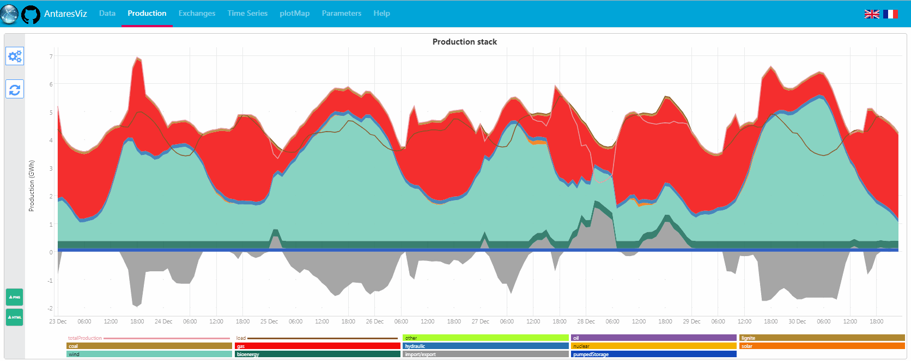
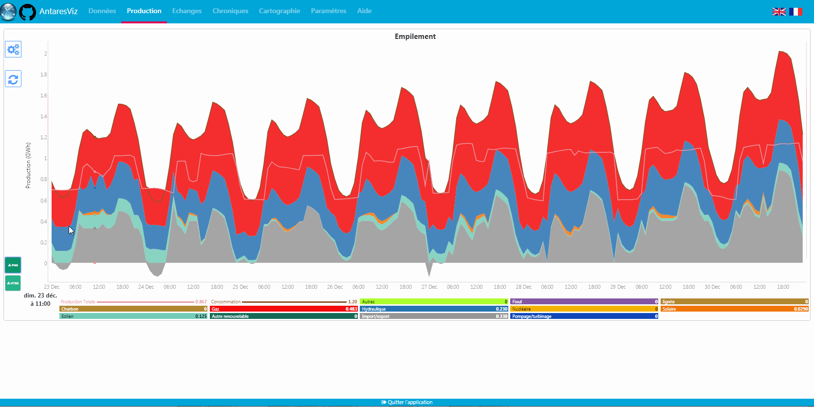
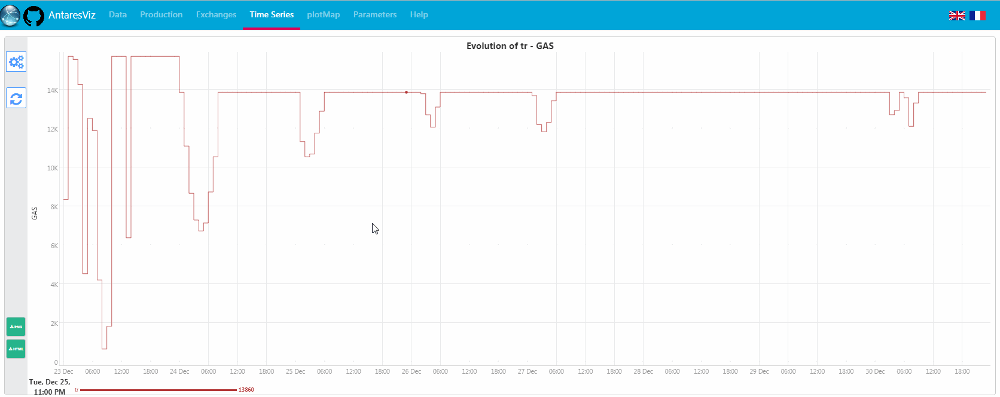
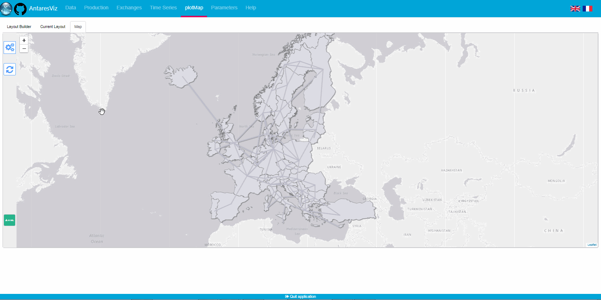
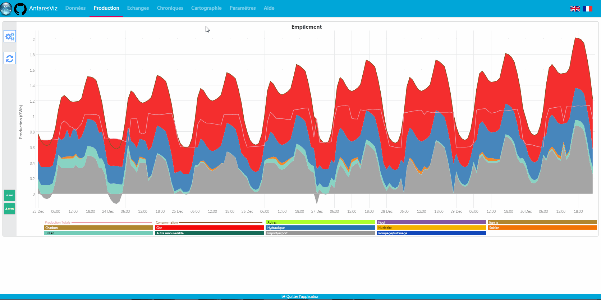
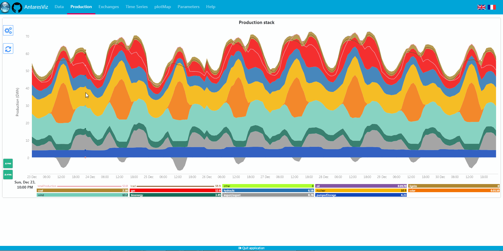

```{r setup, include=FALSE}
knitr::opts_chunk$set(echo = TRUE)
```

## Introduction

`antaresViz-0.13` is on CRAN. It includes new features. This document introduces some of them. 


## Plot a stack for annual data 

`prodStack()` and `exchangesStack()` can plot annual data. 



## Save a plot in PNG or HTML

Download a plot in PNG and integrate it into a PowerPoint. Currently, maps can only be downloaded in HTML. 



## Plot several Monte Carlo years 

`tsPlot` can now plot several variables for several Monte Carlo years. 



## Save time using aliases 

Set an alias on plotMap to save time. `plotMap()` has a new argument `typeSizeAreaVars` to take into account all aliases set in `antaresViz`. 



## Change the language from English to French

All parameters and captions have an equivalent in French. 



## Ask for new features easily 

From `antaresViz`, ask a new feature by clicking on github icon.  


