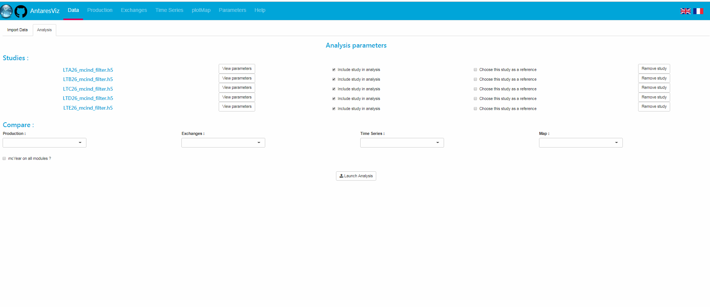

```{r setup, include=FALSE}
knitr::opts_chunk$set(echo = TRUE)
knitr::opts_chunk$set(out.width='100%')
library(antaresViz)
```

# Introduction

`antaresViz-0.15` is on CRAN. It includes new features. This document introduces some of them. 

Install `antaresViz` with :


```{r installAntaresViz, echo = TRUE, eval = FALSE}

install.packages("antaresViz")

```


# Reference study 

`runAppAntaresViz()` run a shiny app. You can now use a reference study in your analysis process. Someone can now compare several strategies from a reference study. This process use the function 'antaresProcessing::compare'.
You can find the description of compare [here](https://cran.r-project.org/web/packages/antaresProcessing/antaresProcessing.pdf#compare). 



# Reference study with interactive set to FALSE

You can also use a reference study outside the shiny app. `prodStack()`, `exchangesStack`, `plot` and `plotMap` have a new parameter `refStudy` to set the reference study. 


```{r importData, echo=FALSE, message=FALSE}
#here import data 

refStudy <- "E:\\ANTARES\\h5_BP\\LTA26_mcind_filter.h5"
alternative1 <- "E:\\ANTARES\\h5_BP\\LTB26_mcind_filter.h5"
alternative2 <- "E:\\ANTARES\\h5_BP\\LTC26_mcind_filter.h5"
mlLayout <- readRDS("E:\\ANTARES\\Exemple_antares/mapLayout/BP_ml.RDS")
optsRef <- setSimulationPath(path = refStudy)
refData <- readAntares(areas = "all", 
                       links = "all", 
                       opts = optsRef)
optsAlter1 <- setSimulationPath(path = alternative1)
myData01 <- readAntares(areas = "all", 
                        links = "all", 
                        opts = optsAlter1)
optsAlter2 <- setSimulationPath(path = alternative2)
myData02 <- readAntares(areas = "all", 
                        links = "all", 
                        opts = optsAlter2)

```

Import your data before comparing. 

```{r importDataFake, echo = TRUE, eval = FALSE}
#here import your data 

refStudy <- "pathToRefStudy"
mlLayout <- load("myLayout")
#reference study
optsRef <- setSimulationPath(path = refStudy, simulation = -3)
refData <- readAntares(areas = "all", 
                       links = "all", 
                       opts = optsRef)
#strategie 1
optsAlter1 <- setSimulationPath(path = refStudy, simulation = -2)
myData01 <- readAntares(areas = "all", 
                        links = "all", 
                        opts = optsRef)
#strategie 2
optsAlter2 <- setSimulationPath(path = refStudy, simulation = -1)
myData02 <- readAntares(areas = "all", 
                        links = "all", 
                        opts = optsRef)

```

## prodStack 

We can compare easily the production between the strategies and the reference study. 
For example, for strategy one, we produce more gas than the reference study and less nuclear.  

```{r prodStack, echo = TRUE, eval = TRUE}
myDataRange <- c("2029-01-09 00:00:00", 
                 "2029-01-16 00:00:00")

prodStack(x = list(myData01, myData02),
          refStudy = refData,
          interactive = FALSE,
          areas = "fr",
          dateRange = myDataRange)

```

## exchangesStack 

Flows can be very different between the two strategies. 
What is the best strategy for exporting more in January?

```{r exchangesStack, echo = TRUE, eval = TRUE}

exchangesStack(x = list(myData01, myData02),
               refStudy = refData,
               interactive = FALSE,
               area = "fr",
               dateRange = myDataRange)

```

## plotMap 

You can also compare the production and flows evolutions on a map.

```{r plotMapRef, echo = TRUE, eval = TRUE, out.width='100%', fig.height=8}

plotMap(x = list(myData01, myData02),
        refStudy = refData,
        mapLayout = mlLayout,
        type = "avg",
        interactive = FALSE,
        colAreaVar = "LOAD",
        typeSizeAreaVars = TRUE,
        aliasSizeAreaVars = c("generation", "renewable"),
        colLinkVar = "CONG. PROB +",
        sizeLinkVar = "FLOW LIN.",
        sizeMiniPlot = TRUE)

```


## plot 

We can also focus our attention on the evolution of a variable.

```{r tsPlot, echo = TRUE, eval = TRUE}

plot(x = list(myData01, myData02),
     refStudy = refData,
     interactive = FALSE,
     elements = "fr",
     table = "areas",
     variable = "NUCLEAR",
     type = "density")

```
