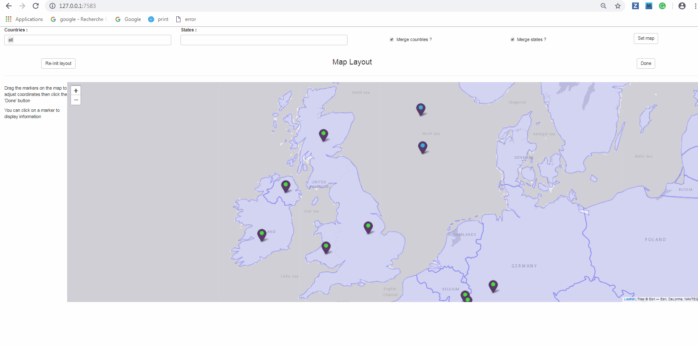

```{r setup, include=FALSE}
knitr::opts_chunk$set(echo = TRUE)
knitr::opts_chunk$set(out.width='100%')
library(antaresViz)
```

# Introduction

`plotMap()` is one of the best `antaresViz` function. But to be able to change color areas, we have to provide a layout. This document will show how to build a useful layout.

Install `antaresViz` with :


```{r installAntaresViz, echo = TRUE, eval = FALSE}

install.packages("antaresViz")

```


# With mapLayout() we can do almost anything 

Before showing how to use mapLayout(), we must import our data. 

```{r importData, echo=FALSE, message=FALSE}
#here import data 

refStudy <- "E:\\ANTARES\\h5_BP\\LTA26_mcind_filter.h5"
mlLayout <- readRDS("E:\\ANTARES\\Exemple_antares/mapLayout/BP_ml.RDS")
optsRef <- setSimulationPath(path = refStudy)
refData <- readAntares(areas = "all", 
                       links = "all", 
                       opts = optsRef)

```


```{r importDataFake, echo = TRUE, eval = FALSE}
#here import your data 

refStudy <- "pathToRefStudy"
#reference study
optsRef <- setSimulationPath(path = refStudy, simulation = -3)
refData <- readAntares(areas = "all", 
                       links = "all", 
                       opts = optsRef)

```

## Default use of mapLayout

This function will launch an application that let you place your areas. Click "Next" at each step and then click "Done".

```{r defaultMapLayout, echo = TRUE, eval = FALSE}
#import x, y areas position 

posLayout <- readLayout()

mlDefault <- mapLayout(layout = posLayout)

saveRDS(object = mlDefault,
        file = "inst/mlDefault.RDS")

```


You can visualize your layout with `plotMapLayout`. 

```{r plotMapLayout, echo = TRUE, eval = TRUE}

mlDefaultR <- readRDS(file = "inst/mlDefault.RDS")
plotMapLayout(mlDefaultR)

```

`plotMap` can now use this layout to represent your areas. 


```{r plotMap, echo = TRUE, eval = TRUE}

plotMap(x = refData,
        mapLayout = mlDefaultR,
        interactive = FALSE,
        colAreaVar = "LOAD",
        colLinkVar = "FLOW LIN.",
        type = "avg")

```


## Option merge states 
If you need states details but not having one area per state, the map will be incomplete for some countries, plotting only states with area. So you can choose to aggregate the states of the countries. This is done using a nearest states algorithm. The result is available only after layout validation.

### When merge states is set to FALSE

We will illustrate how `mapLayout()` works with the option `merge states` set to false. 

```{r mergeState, echo = TRUE, eval = FALSE}

mlStatesF <- mapLayout(layout = posLayout)
saveRDS(object = mlStatesF,
        file = "inst/mlStatesF.RDS")

```


You can visualize your layout with `plotMapLayout`. 

```{r plotMapLayoutSF, echo = TRUE, eval = TRUE}

mlDefaultSF <- readRDS(file = "inst/mlStatesF.RDS")
plotMapLayout(mlDefaultSF)

```

States are not aggregated. `plotMap` can use this layout to represent your areas but the result may not be very nice.


```{r plotMapSF, echo = TRUE, eval = TRUE}

plotMap(x = refData,
        mapLayout = mlDefaultSF,
        interactive = FALSE,
        colAreaVar = "LOAD",
        colLinkVar = "FLOW LIN.",
        type = "avg")

```

### When merge states is set to TRUE

If you want a beautiful map you must set `merge states` to TRUE. 

```{r mergeStateT, echo = TRUE, eval = FALSE}

mlStatesT <- mapLayout(layout = posLayout)
saveRDS(object = mlStatesT,
        file = "inst/mlStatesT.RDS")

#!
```

[](inst/dataViz/mapLayoutST.gif)

You can check your layout with `plotMapLayout`. 

```{r plotMapLayoutST, echo = TRUE, eval = TRUE}

mlDefaultST <- readRDS(file = "inst/mlStatesT.RDS")
plotMapLayout(mlDefaultST)

```

States are now aggregated, the result from `plotMap()` is a little nicer. 


```{r plotMapST, echo = TRUE, eval = TRUE}

plotMap(x = refData,
        mapLayout = mlDefaultST,
        interactive = FALSE,
        colAreaVar = "LOAD",
        colLinkVar = "FLOW LIN.",
        type = "avg")

```

## Option merge countries

Some countries like UK or Belgium are firstly rendered in multiple and diffrent area. You can so choose to finally use this countries as one single area on the map.

### When merge countries is set to FALSE

We will illustrate how `mapLayout()` works with the option `merge countries` set to false. 

```{r mergeCountriesF, echo = TRUE, eval = FALSE}

mlCounF <- mapLayout(layout = posLayout)
saveRDS(object = mlCounF,
        file = "inst/mlCounF.RDS")

```


You can visualize your layout with `plotMapLayout`. Countries are not aggregated.

```{r plotMapLayoutCF, echo = TRUE, eval = TRUE}

mlCountF <- readRDS(file = "inst/mlCounF.RDS")
plotMapLayout(mlCountF)

```

For United Kingdom, we will have countries details in `plotMap()`. Each country (England, Scotland, Wales and Nothern Ireland) will have a color that represent the parameter `colAreaVar` here `LOAD`.

```{r plotMapCF, echo = TRUE, eval = TRUE}

plotMap(x = refData,
        mapLayout = mlCountF,
        interactive = FALSE,
        colAreaVar = "LOAD",
        colLinkVar = "FLOW LIN.",
        type = "avg",
        typeSizeAreaVars = TRUE,
        aliasSizeAreaVars = c("generation", "renewable"),
        sizeMiniPlot = TRUE,
        areaChartType = "pie")

```


### When merge countries is set to TRUE

If we want to aggregate countries, we have to set `merge countries` to TRUE. 


```{r mergeCountriesT, echo = TRUE, eval = FALSE}

mlCounT <- mapLayout(layout = posLayout)
saveRDS(object = mlCounT,
        file = "inst/mlCounT.RDS")

```



Countries are now aggregated.

```{r plotMapLayoutCT, echo = TRUE, eval = TRUE}

mlCountT <- readRDS(file = "inst/mlCounT.RDS")
plotMapLayout(mlCountT)

```

Now, for United Kingdom, we will have one color representing the parameter `colAreaVar` for the four countries. 

```{r plotMapCT, echo = TRUE, eval = TRUE}

plotMap(x = refData,
        mapLayout = mlCountT,
        interactive = FALSE,
        colAreaVar = "LOAD",
        colLinkVar = "FLOW LIN.",
        type = "avg",
        typeSizeAreaVars = TRUE,
        aliasSizeAreaVars = c("generation", "renewable"),
        sizeMiniPlot = TRUE,
        areaChartType = "pie")

```

# Get a layout from another source 

A user can choose to import a different layout from the default one. 
The default one is obtained from `spMaps::getSpMaps()`. Anyone can download some `SpatialPolygonsDataFrame`, for example, from [here](https://gadm.org/download_country_v3.html). 

Here, we have choose :
- Spain, Level 1 ;
- Belgium, Level 1 ;
- France, Level 2. 

```{r rbindSP, echo = TRUE, eval = FALSE}

#before using it in mapLayout, we must read all files 

sp1 <- readRDS(file = "inst/sp/gadm36_ESP_1_sp.rds")
be1 <- readRDS(file = "inst/sp/gadm36_BEL_1_sp.rds")
fr2 <- readRDS(file = "inst/sp/gadm36_FRA_2_sp.rds")

#same level use rbind
spBe <- rbind(sp1, be1) 
#different level use union
spBeFr <- union(spBe, fr2) 
mlNewMap <- mapLayout(layout = posLayout, map = spBeFr)
saveRDS(object = mlNewMap,
        file = "inst/mlNewMap.RDS")

```

.......

```{r plotMapLayoutNewSP, echo = TRUE, eval = TRUE}

mlNewMap <- readRDS(file = "inst/mlNewMap.RDS")
plotMapLayout(mlNewMap)

```

.......

```{r plotMapNSP, echo = TRUE, eval = TRUE}

plotMap(x = refData,
        mapLayout = mlNewMap,
        interactive = FALSE,
        colAreaVar = "LOAD",
        colLinkVar = "FLOW LIN.",
        type = "avg",
        typeSizeAreaVars = TRUE,
        aliasSizeAreaVars = c("generation", "renewable"),
        sizeMiniPlot = TRUE,
        areaChartType = "pie")

```
